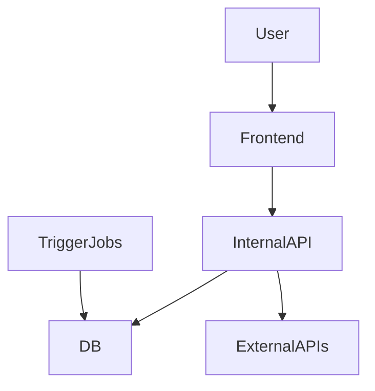

# Implementation Plan: Unified Next.js Turborepo Architecture

**Date**: 2025-06-24
**AI Agent**: Codex
**Reviewer**: TBD
**Status**: Draft

## Overview

This plan describes migrating Super Chatbot to a Turborepo-based monorepo using Next.js for all micro-applications. The goal is to replace the Python backend with a unified TypeScript stack, reuse existing schemas, and maintain compatibility with Drizzle ORM. Each application (landing, generators, editor, chatbot, researcher, admin, social, and video player) will live in a dedicated package under the monorepo while sharing common libraries and database models.

## Requirements

### Functional Requirements
- [ ] Provide a landing page application
- [ ] Deliver micro-apps for image, video and prompt generation
- [ ] Maintain the legacy storyboard editor with shared modules
- [ ] Implement a chat agent interface
- [ ] Provide a trend research tool for marketing
- [ ] Implement an admin dashboard for project management and billing
- [ ] Add social features and media player with Remotion.js
- [ ] Support user account management with Stripe payments and credit tracking

### Non-Functional Requirements
- [ ] Use existing database schemas from the Python backend
- [ ] Migrate Prefect flows to Trigger.dev jobs
- [ ] Support modular build via Turborepo
- [ ] Keep deployment on Vercel with unified environment management

## Architecture Decisions

### Component Structure
```
packages/
  landing/
  generators/
  editor/
  chatbot/
  researcher/
  admin/
  social/
  player/
  ui/            # shared design system
  db/            # Drizzle ORM models and migrations
  jobs/          # Trigger.dev jobs
```
Each app is a Next.js project configured as a Turborepo package. Shared components and utilities reside under `ui` and `lib` packages. Database models remain centralized in `db`.

### Data Flow


### State Management
- Local component state with `useState` or `useReducer`
- Shared state using Zustand
- Server state via `react-query`/`SWR`

### Database Schema Changes
No structural changes. Existing Python tables are recreated in Drizzle to ease migration. Additional tables for social features may be added later.

## SuperDuperAI Integration

### APIs to be Used
- [ ] Image Generation
- [ ] Video Generation
- [ ] File Management
- [ ] SSE for real-time updates

### Authentication Strategy
- Configure OpenAPI client server-side in each package
- Store tokens in environment variables per app

### Error Handling
- Implement typed proxy pattern for API routes
- Central error utilities shared across packages

### Real-time Updates
- Use existing SSE connection logic from `/artifacts/video/server.ts`
- Consider Next.js proxy for SSE if needed

## API Design

### New Endpoints
- `app/api/*` endpoints within each package follow REST conventions
- Admin app adds `/api/projects` and `/api/billing`

### Existing Endpoint Modifications
- Gradually replace Python FastAPI endpoints by porting logic to Next.js API routes

## Dependencies

### New Packages
```json
{
  "@vercel/kv": "latest",
  "@trigger.dev/sdk": "latest"
}
```

### Potential Conflicts
- Ensure package versions align across all packages via Turborepo workspace settings

## Implementation Steps

### Phase 1: Turborepo Setup
1. [ ] Create Turborepo with `packages` directory
2. [ ] Migrate current Next.js app into `packages/chatbot`
3. [ ] Extract shared `ui`, `lib`, and `db` packages
4. [ ] Configure Drizzle migrations in the `db` package

### Phase 2: Port Python Features
1. [ ] Recreate database schemas in Drizzle using existing models
2. [ ] Port FastAPI endpoints to Next.js API routes
3. [ ] Move Prefect flows to Trigger.dev jobs in `jobs`
4. [ ] Validate data compatibility with migration scripts

### Phase 3: Micro-App Development
1. [ ] Build landing app with marketing pages
2. [ ] Develop generators package for image/video/prompt tools
3. [ ] Integrate the legacy editor by importing modules into `packages/editor`
4. [ ] Implement researcher, admin, social, and player packages
5. [ ] Establish shared authentication and payment logic

### Phase 4: Testing & Deployment
1. [ ] Write unit tests for shared packages
2. [ ] Add Playwright smoke tests for each micro-app
3. [ ] Configure Vercel deployment for Turborepo
4. [ ] Archive this plan upon completion

## Testing Strategy

### Unit Tests
- Drizzle models
- Shared utilities

### Integration Tests
- API route logic
- Trigger.dev job execution with mocks

### E2E Tests
- Basic user flows for each app using Playwright

### Manual Testing Checklist
- [ ] Verify login and Stripe billing
- [ ] Test each generator tool end-to-end
- [ ] Validate admin dashboard functions
- [ ] Confirm social features and video player

## Security Considerations
- Input validation with Zod across all packages
- NextAuth session protection
- Rate limiting for API endpoints

## Performance Considerations
- Turborepo incremental builds
- Cache DB queries with Drizzle
- Optimize bundle sizes by sharing `ui` package

## Deployment Considerations
- Single Vercel project with Turborepo support
- Environment variable management per package via Vercel
- Database migrations run through `pnpm db:migrate` in CI

## Risk Assessment

### High Risks
- Migration from Python may cause data mismatches
  - **Mitigation**: Run staged migration and verify with tests

### Medium Risks
- Trigger.dev capacity limits
  - **Mitigation**: Evaluate Inngest or Vercel Cron as fallback

### Low Risks
- Turborepo learning curve
  - **Mitigation**: Start small and document each package setup

## Success Metrics
- Consolidated codebase with >80% code in TypeScript
- CI passes for all packages
- Production deployment on Vercel with all micro-apps accessible

## Rollback Plan
- Keep Python backend operational during migration
- Feature flag new endpoints until stable

## Post-Implementation
- Monitor error rates with Sentry
- Update documentation in `/docs` packages
- Plan follow-up improvements for scaling

---

## Approval

**Implementation Plan Reviewed By**: TBD
**Date**: TBD
**Status**: Pending Review
**Comments**: N/A

**Ready for Implementation**: No
**Estimated Timeline**: 10 weeks
**Assigned AI Agent**: Codex
